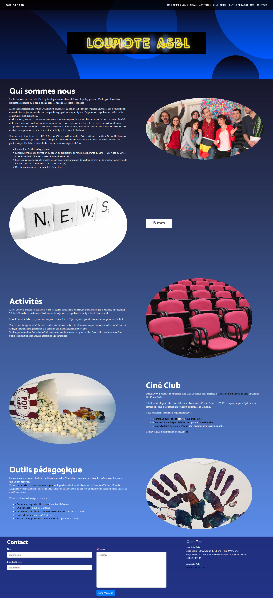

# Page de présentation.

### Projet fait par:  
[Nadir Mohamd Ali](https://github.com/medleew)

### Qu’est-ce que c’est ?  
Réalisation d'un site web en 8h : [Fil Rouge :"Guerrilla"](https://github.com/becodeorg/lovelace-2/blob/master/Projects/fil-rouge/phase-1.md)

### Quand a t'il été réalisé ?  
31 Mai 2018.

### A quoi ça ressemble ?  

### Qu’est-ce que ça contient ?  
Création d'un one-pager en utilisant un template en s'insiprant du site de [Loupiote Asbl](http://www.loupiote.be/).

### Comment on l’installe ?  
[Le projet](https://medleew.github.io/filrouge-0-guerrilla/)

### Languages utilisés ?  
HTML5, CSS3, Bootstrap.
